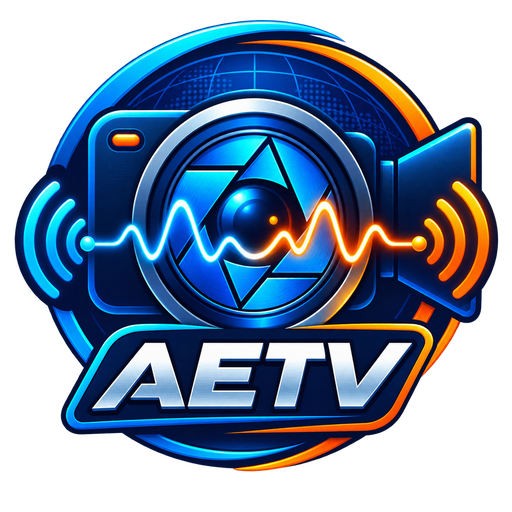
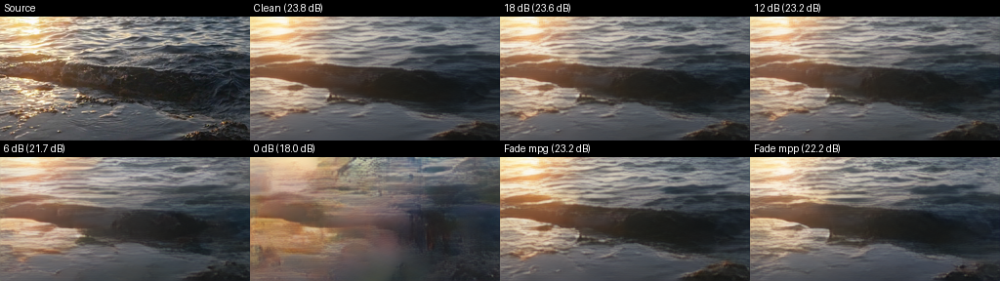
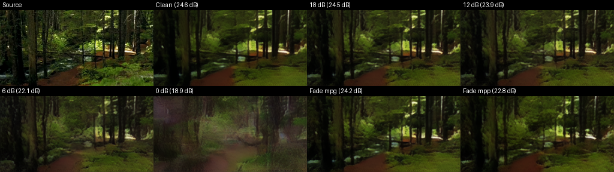
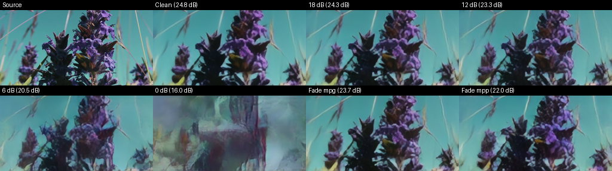

<p align="center">
  
</p>

<h1 align="center">AETV</h1>

<p align="center"><strong>Live video that keeps going when the radio channel gets ugly.</strong></p>

<p align="center">
  <a href="https://github.com/plaingca/AETV/actions/workflows/ci.yml"></a>
  <a href="https://github.com/plaingca/AETV/actions/workflows/release-packages.yml"></a>
</p>

AETV sends moving color video over amateur-radio audio paths. It uses a learned
video codec and an OFDM waveform designed to fade gracefully as noise and
multipath increase—more like analog television than an all-or-nothing video
call.

The station app handles camera or file playback, reception, soundcards,
FlexRadio network audio, CAT/PTT, public KiwiSDR monitoring, and local channel
simulation from one window.

## Two release modes

| Mode | Best for | Picture | Radio audio |
|---|---|---:|---:|
| **Standard channel** | Typical HF/VHF SSB paths and CPU-only stations | 192×108 at 6 fps | Fits a standard transmit channel |
| **Wide 8 kHz** | Higher-detail links through FlexRadio or other wide audio paths | 256×144 at 12 fps | 8 kHz occupied bandwidth, 24 kHz audio |

Only these checksum-verified modes appear in the release GUI. Both stations
must select the same mode.

## See it over the channel

These are held-out evaluation clips from the validated Wide 8 kHz receiver
model. Each grid shows the source, clean loopback, 18/12/6/0 dB paths, and two
multipath fading profiles. Click a frame to play the one-second clip.

| Moving water | Forest tracking | Fine detail |
|---|---|---|
| [](docs/demos/ocean-motion.mp4) | [](docs/demos/forest-motion.mp4) | [](docs/demos/flower-motion.mp4) |

The Wide 8 kHz model was also exercised over a 40 m FlexRadio path. A 71-GOP
off-air receiver-validation sweep and the full measurement notes are in
[the performance report](docs/performance.md).

## Download and run on Windows

1. Download the current Windows zip from
   [Releases](https://github.com/plaingca/AETV/releases).
2. Extract it anywhere.
3. Run `AETV.exe`.

The portable builds include Python and the app libraries, but no model weights
or PyTorch. On first use of a mode, AETV downloads that mode's checksum-pinned
ONNX graphs from [AETV/AETV on Hugging Face](https://huggingface.co/AETV/AETV)
and caches them per user. Each mode is about 206 MiB. Windows may show a
SmartScreen prompt until release binaries are code-signed.

FlexRadio control, serial PTT, VOX/manual PTT, soundcards, and Hamlib direct rig
control are self-contained. Windows packages include the official dynamically
loaded Hamlib 4.7.2 runtime under LGPL-2.1-or-later, its licence, and an exact
source link. The DLL remains replaceable with an ABI-compatible Hamlib build.

Choose the CPU build for the Standard channel mode. Choose the GPU build for
Wide 8 kHz or for extra processing headroom. It uses Windows DirectML, so it can
run on current NVIDIA, AMD, and Intel GPUs without bundling the multi-gigabyte
CUDA/cuDNN training stack, and it still has a CPU fallback.

Linux, Windows CPU, and Windows GPU packages are built and smoke-tested on
GitHub Actions workers. Run the **Release packages** workflow manually for
short-lived downloadable artifacts; version tags such as `v0.1.1` publish the
files to GitHub Releases.

## What hardware works?

One GOP represents one second on air, so encode or decode must finish inside
one second for live operation.

Measured on a Ryzen 7 5800X (8 cores/16 threads):

| Release mode | Encode | Decode | Result |
|---|---:|---:|---|
| Standard channel, CPU | 414 ms | 629 ms | Real-time half-duplex transmit and receive |
| Wide 8 kHz, CPU | 1,182 ms | 1,962 ms | Not real time |

Measured on an RTX 4080 with the native CUDA development backend:

| Release mode | Encode | Decode |
|---|---:|---:|
| Standard channel, CUDA | 13 ms | 19 ms |
| Wide 8 kHz, CUDA | 34 ms | 71 ms |

The redistributable GPU package uses DirectML rather than the CUDA development
backend, so timings vary by Windows driver and GPU. Run its included benchmark
to measure the deployed backend directly.

For CPU-only use, a recent 8-core/16-thread desktop is a practical baseline for
Standard channel mode. Slower machines can still decode recordings, but may not
keep up live. Wide 8 kHz should be treated as a GPU mode for now. Run the
included benchmark on another rig for a direct answer:

```powershell
AETV-Benchmark.exe --mode V8 --device cpu
```

Detailed methodology and current machine results live in
[docs/performance.md](docs/performance.md).

## First contact

- Enter your callsign in **Settings**.
- Pick **Standard channel** unless both ends have an 8 kHz audio path.
- Select the radio input/output devices and configure CAT/PTT if desired.
- Use **Local loopback** first. It exercises the complete modem without keying a radio.
- Confirm your licence, regional band plan, occupied bandwidth, frequency, and power before transmitting.

AETV identifies transmissions, but it cannot decide whether a frequency or
bandwidth is legal at your station.

## Run from source

Source installs are for development; most operators should use the Windows
release.

```powershell
git clone https://github.com/plaingca/AETV.git
cd AETV
uv sync --extra gui --extra train
uv run aetv-gui
```

Source development keeps PyTorch available for native checkpoints and training.
The GUI prefers the same ONNX runtime downloads as the portable packages and
verifies every component's size and SHA-256. Set `AETV_OFFLINE=1` to forbid
network model downloads or `AETV_MODEL_DIR` to choose the cache location.

The release builders use two isolated environments: a temporary CPU-only Torch
environment exports each checkpoint to fixed-shape ONNX encoder/decoder graphs,
then a clean ONNX Runtime environment freezes the GUI. PyTorch remains in the
`train` extra and is never copied into an operator package.

## Build, test, and contribute

```powershell
uv sync --extra gui --extra train --extra dev
uv run pytest -q
uv run python scripts/benchmark_inference.py --mode V8 --device cpu
./scripts/build_windows.ps1 -Runtime cpu
./scripts/build_linux.sh
```

The build fetches and verifies both pinned training checkpoints, exports the
runtime graphs for an offline packaged smoke test, then removes all model files
before producing the archive. Use `-Runtime gpu` for the DirectML build
(`-Runtime cuda` remains a compatibility alias).

Training can capture and publish a final runtime bundle directly:

```powershell
uv run python scripts/train.py ... --export-onnx --runtime-name my-model
uv run python scripts/train.py ... --push-onnx-to-hub `
  --runtime-name my-model --runtime-repo AETV/AETV
```

Hub publication is opt-in and uses the normal `HF_TOKEN`/Hugging Face login.
The exporter writes a `.release.json` containing the exact byte counts and
SHA-256 values needed to pin a newly promoted release model.

The modem contract, model experiments, OTA notes, training commands, and
hardware integrations are kept in [docs](docs/) so the main page can stay
focused on operating the software. Start with the
[ham operator guide](docs/ham-guide.md), [model index](models/README.md), and
[propagation planner](docs/propagation-planner.md).

## Licence

AETV is released under the [Artistic License 2.0](LICENSE). Third-party notices
are collected in [NOTICE](NOTICE).
