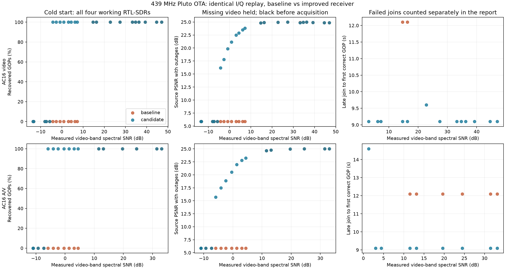
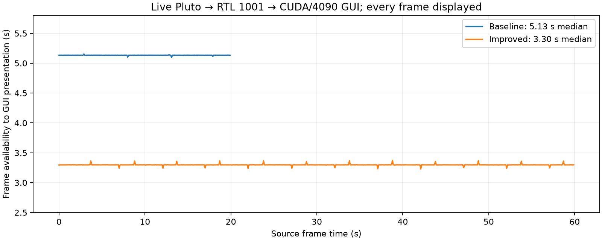

# AC16 receiver acquisition and latency — 14 September 2026

The receiver now acquires weaker SDR signals, handles oscillator warmup during
late entry, and starts video with one decoded GOP. A live 4090/Pluto/RTL trial
displayed all 600 frames at a median **3.297 s** from source-frame availability
to GUI presentation, versus **5.135 s** in the released rc6 baseline.

This is a host pipeline measurement. It excludes camera exposure/readout and
physical display scanout; no optical glass-to-glass instrument was attached.
The model still gathers ten frames and sends one second of payload per GOP.

## Changes

- Coarse SDR calibration tries a stable half-second spectrum first. When
  noise prevents reliable occupied-bandwidth edges, it compares the two known
  video-band edges with adjacent noise and requires energy in four interior
  slices. Audio is excluded from the A/V frequency estimate. This gives the
  modem access to weak signals that rc6 withheld indefinitely in calibration.
- Blind acquisition begins at six seconds, with attempts every half second.
  It retains the twelve-second window for arbitrary beacon phase and the
  existing repeated-beacon fallback. A beacon is 181 chips at 32 chips/s;
  a fixed twelve-second initial wait was unnecessary.
- Cyclic-prefix observations estimate supported oscillator drift across the
  acquisition window. The beacon is decoded after removing that drift, and
  tracking starts with the frequency of the newest complete GOP. Returning
  the frequency at the window midpoint could land an integer 8 Hz away from
  the current signal: pilots then looked healthy while the picture was wrong.
- CUDA kernel initialization occurs while loading the model. Pluto opens and
  tunes with its transmitter powered down while the first live GOP is gathered.
- AC16 video starts with one GOP; frame pacing and the bounded queue remain.
  A/V retains its paired audio/video playout. Persistent observed RTL ADC
  clipping produces an actionable gain message without changing operator gain.

No checkpoint, latent layout, RF bandwidth, pilot, interleaver, beacon CRC,
payload acceptance threshold, or audio/video wire timing changed. The earlier
DirectML color qualification and Pluto DAC headroom protection remain enabled.

## Real-radio comparison

Pluto transmitted at a nominal 439 MHz, through the existing antennas about
10 ft from RTL-SDRs **1000, 1001, 1003, and 1004**. Serial 1002 was excluded
because of its known hardware failure. Twelve bounded transmissions produced
48 raw unsigned-eight-bit I/Q captures at 960 ksample/s. TX shutdown was
verified after every transmission. The gain sweep included -65 to 0 dB Pluto
gain; these are hardware attenuation settings, not calibrated radiated dBm.
Most recordings used 37.2 dB RTL gain; the overload recording used 49.6 dB.

Each capture was replayed through the actual SDR conversion and streaming
receiver, starting either before transmission or seven seconds into the
recording. The latter is a true late entry without the startup preamble.
Baseline and candidate consume exactly the same recorded I/Q. Neither receives
source pixels, transmitted latents, known timing, or known CFO for acquisition.

| Gate / outcome | rc6 baseline | Improved receiver |
| --- | ---: | ---: |
| Paired conditions | 96 | 96 |
| Cold-start recordings producing aligned video | 16 / 48 | 31 / 48 |
| Late-entry recordings producing aligned video | 8 / 48 | 22 / 48 |
| Correctly aligned decoded GOPs across all conditions | 376 | 834 |
| Decoded GOPs with incorrect source alignment | 2 | 0 |
| Worst PSNR change on jointly recovered GOPs | reference | -0.0031 dB |
| Six-second fade: delay after signal returns | 14.1 s | 10.1 s |

All 376 jointly recovered GOPs were compared; no cell lost recovery coverage.
The PSNR gate allowed at most 0.05 dB loss **in each paired cell**, not a pooled
tradeoff between strong and weak reception. It passed in every applicable cell.
The waveform still becomes visibly worse as physical SNR falls; this change
does not eliminate the channel's information limit. Recordings below the
acquisition threshold remain explicitly counted as failures.

Representative cold-start results for RTL 1001:

| Mode / measured video-band SNR | Baseline GOPs | Improved GOPs | Improved source PSNR |
| --- | ---: | ---: | ---: |
| Video, 36.3 dB | 20 | 20 | 24.97 dB |
| Video, 6.1 dB | 0 | 20 | 23.51 dB |
| Video, 0.9 dB | 0 | 20 | 21.17 dB |
| Video, -4.2 dB | 0 | 20 | 16.19 dB |
| A/V, 33.1 dB | 20 | 20 | 25.02 dB |
| A/V, 3.0 dB | 0 | 20 | 22.78 dB |
| A/V, -2.4 dB | 0 | 20 | 18.88 dB |
| A/V, -7.3 dB | 0 | 0 | no acquisition |

SNR is an adjacent-noise-subtracted spectral estimate, taking the median of
three one-second payload observations. It is not calibrated RF instrumentation
or the modem's EVM-derived SNR. Clipping in the strongest recording means those
two estimates particularly should not be equated. One sweep per setting and
four receiver paths do not establish a statistical acquisition probability or
performance under every propagation/interference condition.



The outage-inclusive PSNR fills missing GOPs with the last received image and
uses black before the first decode. Late-entry scoring excludes GOPs already
finished when reception begins. Alignment uses the receiver's sample positions
and independent post-hoc reference ranking. An initial `cosine > 0.1` screening
heuristic mislabeled two correctly timed/ranked GOPs at about -6 dB SNR as
framing errors; those remain included, with their actual 15.32/18.35 dB PSNR.
The original screening report is retained with the experiment artifacts.

## Live GUI and A/V checks

The rc6 baseline is the downloaded Linux GPU portable executable from commit
`bdcfad31a35dcbe52adb73793b780d31c40c2e7b`. The final source trial uses the real
GUI TX/RX engines, CUDA ONNX inference on the RTX 4090, and real Pluto/RTL 1001
RF. A paced held-out RGB source replaces the absent camera at its frame output.

| Live trial | Frames displayed | Median latency | 95th percentile |
| --- | ---: | ---: | ---: |
| rc6, 20 seconds | 200 / 200 | 5.135 s | 5.136 s |
| Improved, 60 seconds | 600 / 600 | 3.297 s | 3.298 s |



Six additional A/V capture replays checked unique per-GOP audio tones with
the production audio correction/pairing path, both cold and late entry at
strong, moderate, and weak levels. All recovered audio seconds matched their
video GOP; the maximum measured pitch error was 0.234 Hz. These check decoded
audio samples, not a physical speaker's latency.

## Provenance and reproduction

The 20-second sweep uses the first ten two-second clips from the established
held-out source fixture; the 60-second GUI trial uses all thirty clips. They
are disjoint from training sources/groups but were used for model selection,
so this is validation material, not an untouched final test set.

- Source: `/pool0/AETV-runs/ac16-20260913-realtime/source.npy`, SHA256
  `85f201e2c51902c864e5f2dcd15dea2aa4ddbe51ff8796a47092cc10125d9fdb`.
- Model: AC16 v4, HF revision
  `6f3a4cd4df1e8b261141da75988f3df2750666db`, unchanged production ONNX runtime.
- Baseline source snapshot: `/tmp/aetv-ac16-acquisition-baseline` at rc6.
- Full experiment: `/pool0/AETV-runs/ac16-acquisition-20260914/`. Includes raw
  I/Q, driver logs, source/received latents and confidence, videos, capture
  configuration, per-event timing, failed cases, and scoring scripts.
- Compact machine-readable results: [summary.json](ac16-acquisition-evidence/summary.json).

`scripts/validate_ac16_acquisition.py` reproduces capture and replay with
explicit paths. For example, from a selected source checkout:

```sh
PYTHONPATH=. .venv/bin/python scripts/validate_ac16_acquisition.py \
  replay video-tx40-rx37 \
  --root /pool0/AETV-runs/ac16-acquisition-20260914 \
  --serial 1001 --label verify --join 0
```

`capture` opens the specified host radios and transmits; `replay` does not open
hardware. Capture additionally requires `--source` and `--latents`, accepts up
to sixty GOPs, and records explicit source provenance and transmitter shutdown.
Source validation passed 427 tests (2 skipped). The packet-level regression is also included in every portable executable's
SDR smoke test, with fixed CFO and both directions of 1.5 Hz/s oscillator drift.
