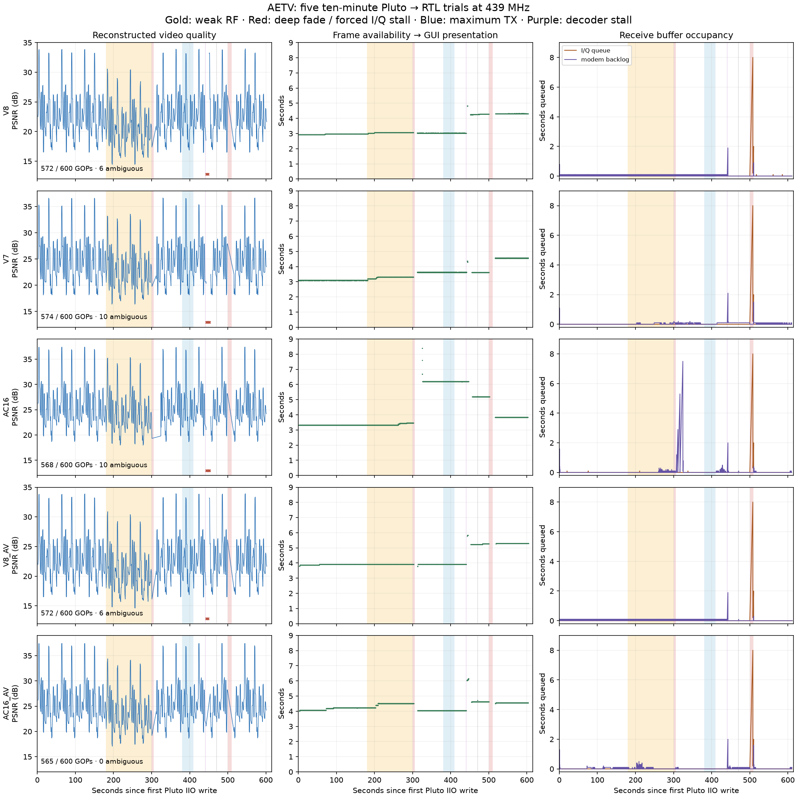
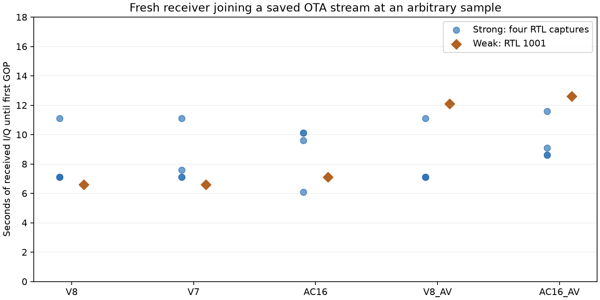
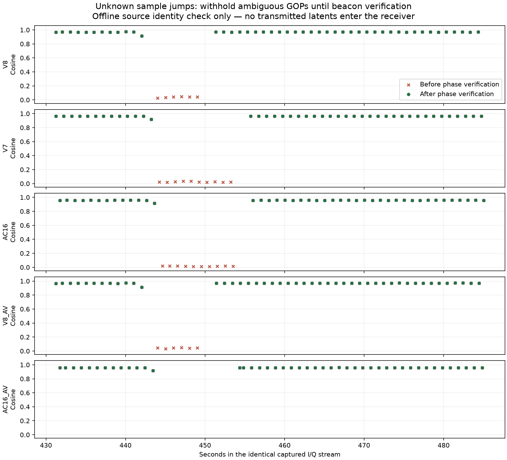

# All-mode SDR reliability evaluation — 2026-09-14

Five released modes were exercised through the production GUI, Pluto transmit,
RTL receive, ONNX inference, audio output and GUI presentation: V8, V7, AC16,
V8 A/V and AC16 A/V. This work changes receiver/transport behavior; model weights
and wire formats remain unchanged.

The final code is `a1b4df938909818d429aac1244738db641414829` (`0.1.20rc10`).
[PR #18](https://github.com/plaingca/AETV/pull/18),
[package build](https://github.com/plaingca/AETV/actions/runs/34889511643),
and [CI](https://github.com/plaingca/AETV/actions/runs/34889516941).
[Stable release downloads](https://github.com/plaingca/AETV/releases/tag/v0.1.20).
The final downloaded Linux executables completed hardware trials in all five modes.

## Setup and evidence boundaries

Pluto transmitted at 439 MHz to RTL serial 1001, approximately ten feet away.
Serials 1000, 1003 and 1004 also captured the ten-minute signals independently;
1002 was excluded because of its known hardware failure. The fixture cycles 30
training-disjoint validation clips over 60 seconds. These were model-selection
validation sources, not an untouched test set. The source array SHA-256 is
`85f201e2c51902c864e5f2dcd15dea2aa4ddbe51ff8796a47092cc10125d9fdb`.

The production camera boundary receives paced frames; no physical camera was
available. Latency means frame availability to the GUI's presentation callback,
excluding exposure and display scanout. PortAudio writes went to a clocked
PulseAudio null sink, exercising scheduling without measuring physical speaker
latency. Source frames/latents and RF start timestamps are used only for offline
scoring and never enter receiver acquisition.

The long trials ran `cce8175` before the final weak-edge refinement and phase
verification gate. V7 and AC16 used the downloaded rc8 GPU executable; the other
three used the matching source runtime. Final fixes were checked on identical
captured I/Q and then in the downloaded rc10 packages. Do not interpret the
original live counts or fault-window pictures as measurements of the final gate.

Raw I/Q, RGB, paired audio, per-frame timestamps, driver logs and failed attempts
are retained locally under `/pool0/AETV-runs/all-modes-stress-20260914`.
The [harness guide](all-modes-sdr-stress.md) provides reproducible configuration
and the received-only replay command. Compact measurements accompany this file.

## Ten-minute mixed-fault trials

Each mode sent 600 one-second GOPs. TX started at -10 dB, weakened at 180 s,
was reduced to -89.75 dB for 300–306 s, reached maximum TX gain for 380–410 s,
and returned to -10 dB. Deliberate stalls: shared codec lock for 2 s at 440 s,
GUI for 350 ms at 470 s, and I/Q conversion for 10 s at 500 s.
Weak TX gains were -50/-45/-40/-47/-40 dB for V8/V7/AC16/V8 A/V/AC16 A/V.
These are separate mode-specific RF conditions, not equal calibrated SNR cells.

| Mode | Original live decoded / 600 | Strong PSNR | Weak PSNR | Initial median presentation latency |
|---|---:|---:|---:|---:|
| V8 | 572 | 21.40 dB | 19.24 dB | 2.98 s |
| V7 | 574 | 22.83 dB | 21.19 dB | 3.09 s |
| AC16 | 568 | 23.94 dB | 22.67 dB | 3.33 s |
| V8 A/V | 572 | 21.40 dB | 19.41 dB | 3.91 s |
| AC16 A/V | 565 | 23.94 dB | 22.02 dB | 4.23 s |

PSNR is pooled from RGB MSE, against the frames actually consumed by the
transmitter. Strong and weak windows are 10–175 s and 190–295 s. Each contained
all 165 and 105 expected GOPs in every mode. Ambiguous source identities are
excluded from quality and latency scoring and counted separately. Deliberate
outages, acquisition waits and invalid GOPs are not scored as ordinary reception.

Every trial had exactly one forced I/Q queue overflow, discarding 7,680,000
complex samples (8 s), and subsequently reacquired without manual restart.
There were no additional I/Q queue overruns, no receiver-ring overruns and no
raw-I/Q/trace recording drops. Each shared-lock stall also caused one observed
TX starvation event. These counters describe host queues; RTL has no reliable
hardware loss counter, and TX starvation is not a DAC underrun-register reading.

Both A/V trials had zero PortAudio underflow flags, zero audio queue drops and
zero A/V playout queue drops. A pending pair was discarded when the I/Q clock
reset. The deliberate GUI stall trimmed one V8 A/V frame and two AC16 A/V frames.
Steady-window identifying-tone errors stayed below 0.27 Hz and 0.38 Hz,
respectively; this verifies pitch/pair association for the fixture, not speech
intelligibility under every channel condition.

The AC16 receive backlog reached 7.5 s once during fade recovery with concurrent
CPU activity; it remained below the 8 s ring capacity. Other modes peaked near
2–2.1 s around the deliberate codec stall. Playback latency can rise after a
stall; this is not a claim of fixed three-second latency in every condition.
The five-minute Save Video history accounts for substantial initial memory
growth; additional I/Q buffers are allocated during the forced stall.

## Acquisition and quality preservation

All 35 final-capture late-entry replays decoded video, with first GOP arrival
6.6–12.6 seconds after their arbitrary starting sample. The matrix includes four
RTL captures per mode at a strong entry point and RTL 1001 entries during weak
RF, after the deep fade, and near the end of the transmission. These times
exclude opening the hardware driver. CRC-verified beacons remain mandatory for
blind GOP phase; neither source timing nor known transmitted payload is used.

The broad weak-spectrum estimator initially failed two development late joins
for an entire 45 s observation. Refining against both local video-bank edges
recovered V7 in 7.1 s and V8 A/V in 15.6 s on those identical samples. Strong
spectral estimation and rejection of noise, tones and ambiguous banks remain
covered by tests.

The clean comparison supplies the same independently received frequency estimate
to the old manual-tuning control and updated receiver. All 88 GOPs per mode have
bit-identical recovered latents and confidence weights: 440 paired GOPs with
zero clean PSNR change. A second comparison includes 100 weak GOPs per mode.
V8, V7, AC16 and AC16 A/V remain bit-identical in those windows. V8 A/V adjusts
its safe FFT timing; the 49 changed GOPs across the full comparison score
19.218 dB before and 19.224 dB after with the same CPU decoder. This is quality
preservation, not a perceptual improvement claim.

The forced TX starvation exposed a separate frame-phase failure: periodic
pilots could remain healthy while deinterleaving the wrong eight-frame group.
The final SDR path holds the last good picture until a fresh beacon verifies
phase. In matched fault-section replays it suppresses all 32 unidentifiable
GOPs: 6 V8, 10 V7, 10 AC16 and 6 V8 A/V. AC16 A/V did not exhibit this failure
in its captured section. All retained outputs match a transmitted GOP with
cosine at least 0.91, and subsequent valid reception resumes. The cost is a
6–10 GOP hold in these examples. The existing soundcard endpoint-servo recovery
policy is retained separately.

## Overload and a real USB stall

Maximum Pluto gain with RTL gain 37.2 dB did not clip the ADC; it was not an
overload qualification. Separate late-start trials used RTL gain 49.6 dB and
maximum Pluto TX gain, then reduced TX by 20 dB. After recovery of the USB device
below, all five modes received video and recovered after that gain reduction.
The initial windows contained approximately 5–8% rail-clipped I/Q components;
restored windows had zero rail clipping. The GUI emitted its lower-gain warning.

The first five late-start attempts received zero I/Q despite the driver reporting
async sampling. System `rtl_sdr` also failed on serial 1001 at both gain settings;
another RTL worked. A USB reset of only idle serial 1001 restored streaming.
Those zero-sample attempts are retained as failures, despite the harness process
finishing. The final app times out a driver that supplies no samples for ten
seconds at startup or three seconds after streaming, closes it and reports a
USB/receiver error. It does not claim to repair a hung USB device automatically.

## CPU and portable validation

The final rc10 Linux executables each transmitted 120 GOPs, with the receiver
started 7.137 seconds after RF began. Each started at its weak TX setting,
changed to -10 dB at 45 s, encountered a two-second shared-codec stall at 60 s,
and a ten-second I/Q-converter stall at 90 s. These final hardware checks are
two minutes per mode; the ten-minute captures above precede the final phase gate.

| Mode | Final package runtime | Decoded GOPs | Receive start to first GOP | Maximum receive backlog |
|---|---|---:|---:|---:|
| V8 | CPU | 74 | 16.50 s | 2.2 s |
| V7 | CUDA | 83 | 11.06 s | 2.1 s |
| AC16 | CPU | 81 | 10.74 s | 2.4 s |
| V8 A/V | CPU | 74 | 16.70 s | 2.2 s |
| AC16 A/V | CUDA | 82 | 11.16 s | 2.0 s |

These start times include driver setup, weak-signal acquisition and inference.
All five resumed through both injected faults and decoded the final source GOP.
All recovered outputs had identifiable source content (minimum best-match latent
cosine 0.708). The missing GOPs include the initial late join, intentional sample
discard and phase-verification holds; this table is not a continuous-delivery claim.
Each mode reported exactly one forced I/Q overflow and one TX starvation, no
receiver-ring overrun, and no raw-recording/trace drop. The bounded camera fixture
dropped 8–28 old frames around the encoder stall rather than accumulating delay.

Both final A/V trials recorded zero PortAudio underflows and zero audio/playout
queue drops. Absolute tone-error p95 was 0.154 Hz for V8 A/V and 0.250 Hz for
AC16 A/V. Each had one damaged audio block next to the deliberate TX starvation:
20.66 Hz and 98.54 Hz peak-tone errors respectively. Every other block was within
0.168 Hz and 0.262 Hz. Recovery did not leave a persistent pitch or GOP-pair offset;
the transient blocks remain a limitation during interrupted RF.

Downloaded rc10 benchmarks on this host, eight CPU threads, ten measured GOPs:

| Model | CPU encode / decode | CPU duplex speed | RTX 4090 encode / decode |
|---|---:|---:|---:|
| V8 | 106 / 218 ms | 3.10× real time | 7.2 / 10.3 ms |
| V7 | 446 / 965 ms | 0.71× real time | 16.7 / 41.9 ms |
| AC16 | 187 / 301 ms | 2.04× real time | 18.5 / 23.5 ms |

These benchmark ratios cover inference only. V7 CPU duplex is below real time;
receive inference alone consumes 965 ms of its one-second budget. An earlier
loaded benchmark measured 1,219 ms, so it has no reliable receive headroom.
The model/runtime are unchanged; these are different load conditions.
AC16 CPU has limited acquisition/duplex headroom: its overloaded late-start trial
under concurrent CPU testing recorded a TX starvation event. V8 A/V's CPU trial
had no audio underflows. GPU operation is the stronger choice for headroom.

Local final suite: **469 passed, 2 skipped**. Linux and Windows CI passed.
Both downloaded Linux tar packages passed native-SDR, GUI Save Video and A/V
smokes, and both actual AppImages passed the bundled-SDR smoke. Reports embedded
in both downloaded Windows ZIPs confirm native-SDR, GUI-SDR and A/V smokes on
the Windows CI runner; the GPU build exercised its CPU fallback there.
All six uploaded binary assets match the SHA-256 hashes and sizes of the
downloaded packages. Compact evidence and checksums accompany the trial release.
Linux execution does not qualify physical Windows/DirectML or HackRF hardware.
V0–V6 separately exercised 21 synthetic protocol cases (cold, late, fade with drift);
they have no released GUI model bundles and are not claimed as hardware modes.
