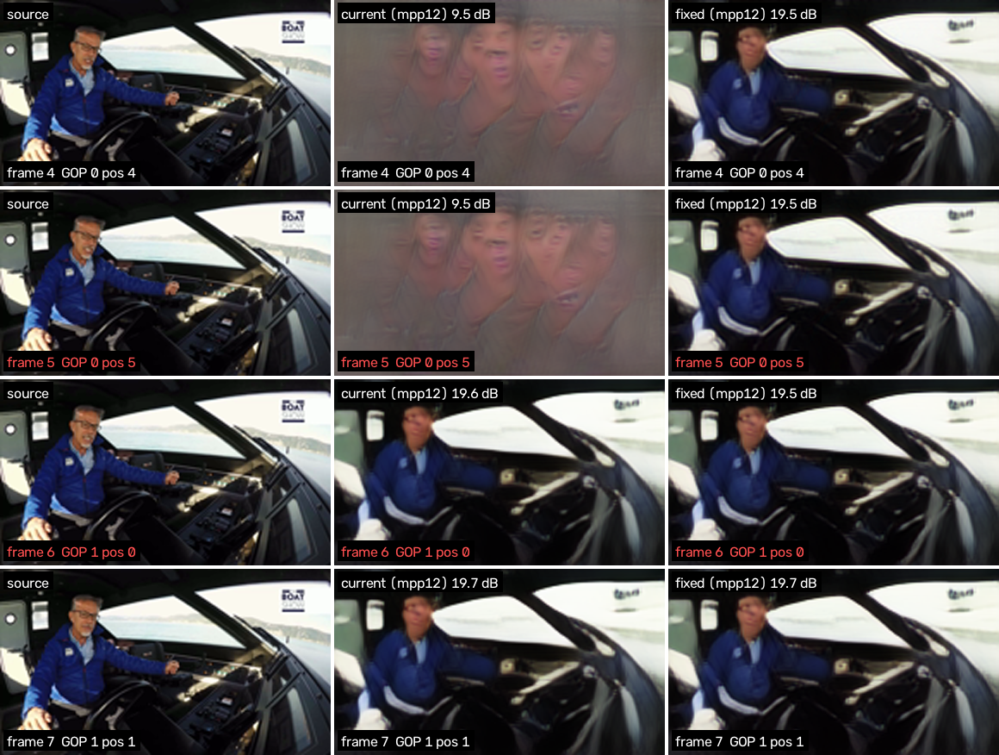
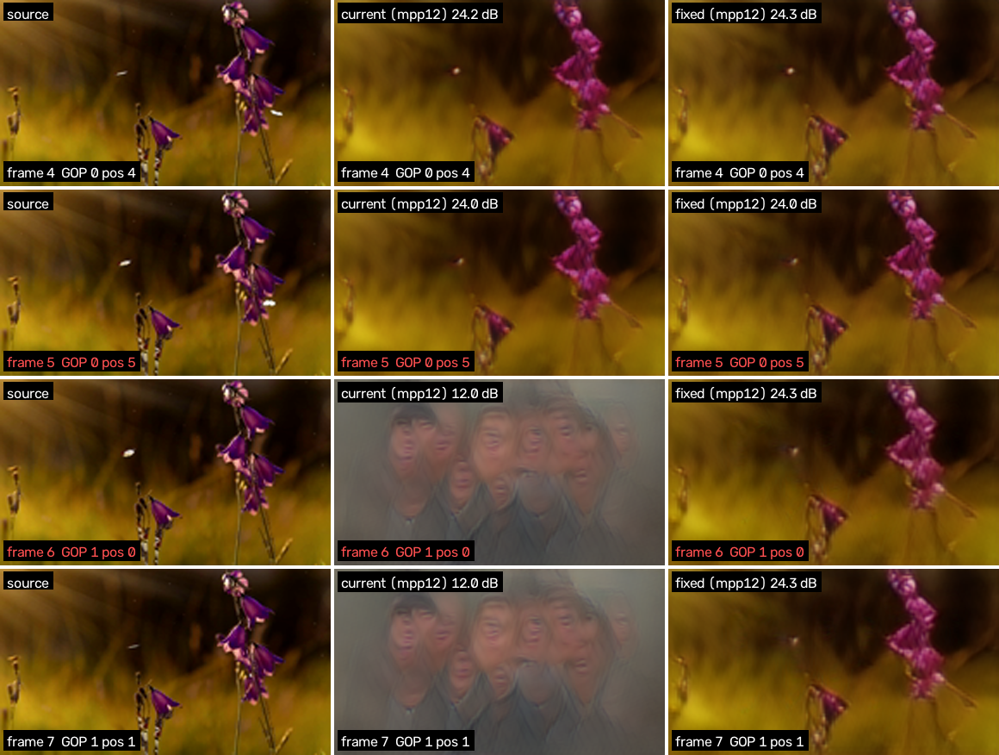
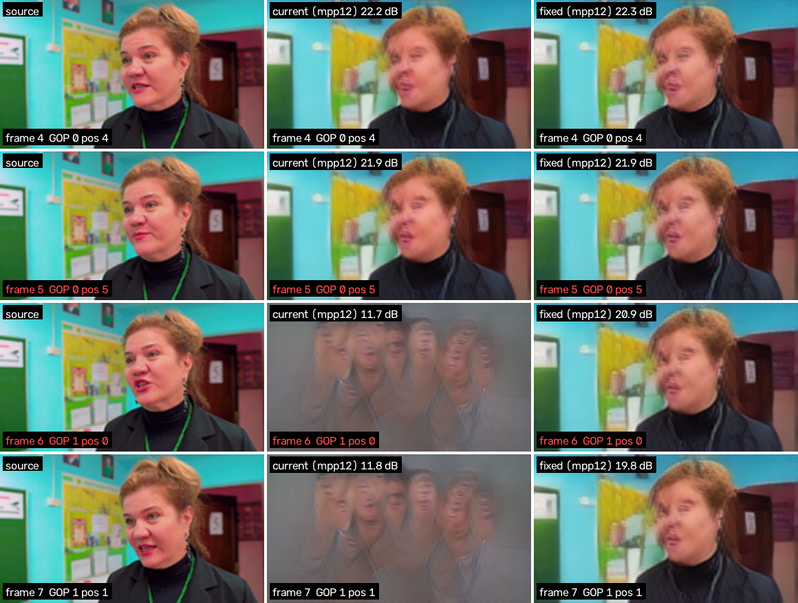

---
cursor:
  subagentId: "bc-7686c10a-0ae8-5b43-a8b3-74588e994224"
---

# GOP boundaries on V8 (issue #7)

**Result: a receiver-side refiner removes the GOP-boundary jump and raises `mpp12` PSNR to 21.77 dB, +1.04 ± 0.17 dB over the current 2.2 kHz best (20.73, PR #29). The wire and the codec are unchanged.**

On the 64 eval clips, scored once, through the V8 modem + `mpp12`:

- **Boundary jump:** the frame-difference PSNR across the GOP boundary rises from 18.96 to 25.61 dB, +6.65 ± 0.74 dB. It is now 0.47 dB below the within-GOP value (26.07), down from 7.1 dB.
- **LPIPS** (`mpp12`) improves from 0.257 to 0.193.
- **All 64 clips** improve on PSNR, on the boundary metric and on LPIPS.

The refiner filters the decoded stream across GOPs, using the neighbouring GOP on each side ("HQ" mode, one GOP of latency). A causal variant has no added latency: it only uses the previous GOP and the current frames. It also passes the gates, but gains half as much.

Code and PR: branch `cursor/gop-boundary-4224` ([PR #33](https://github.com/plaingca/AETV/pull/33)), stacked on PR #29.

## 1. The problem, measured

V8 codes each 6-frame GOP independently. A 12-frame eval clip is two GOPs, so there is one boundary, between frames 5 and 6. The `mpp12` fade is drawn per GOP, so the two halves of a clip get independent errors.

**Metrics** (`aetv/gop_boundary.py`, all computed on `mpp12` output):

- **Frame-difference PSNR** at transition t is `10·log10(1 / MSE((r_t − r_{t−1}) − (s_t − s_{t−1})))`, where r is the reconstruction and s the source. It is 100 dB when the motion is exactly right. The boundary transition is 5→6. The within-GOP value averages the other ten transitions.
- **Excess jump** is `mean|r_t − r_{t−1}| − mean|s_t − s_{t−1}|`, in 8-bit levels. It is positive when the picture moves more than the source.
- **`mpp12` PSNR** is the shared scorer's statistic, the mean of per-GOP PSNR. The measurement harness reproduces the published 20.731 dB to the last digit, as well as LPIPS 0.257.

**Current model (`v8-hf3k-mpp12-ft.pt`), 64 eval clips:**

| Transition | 0→1 | 1→2 | 2→3 | 3→4 | 4→5 | **5→6 (boundary)** | 6→7 | 7→8 | 8→9 | 9→10 | 10→11 |
|---|---:|---:|---:|---:|---:|---:|---:|---:|---:|---:|---:|
| Frame-difference PSNR (dB) | 26.47 | 26.84 | 26.60 | 26.80 | 26.31 | **18.96** | 26.41 | 26.97 | 26.54 | 26.40 | 25.77 |

| Position in GOP | 0 | 1 | 2 | 3 | 4 | 5 |
|---|---:|---:|---:|---:|---:|---:|
| Frame PSNR (dB) | 20.46 | 20.87 | 21.08 | 21.03 | 20.83 | 20.34 |

- **The boundary is 7.1 ± 0.7 dB worse** in frame-difference PSNR than a within-GOP transition.
- **The excess jump** is +15.0 levels at the boundary, against −4.7 inside a GOP. Inside a GOP the picture is slightly too still, but at the boundary it lurches.
- **The first and last frames** of a GOP are 0.6–0.7 dB below the middle frames.

**What the jump looks like.** On a typical clip the face, colour and sharpness change at frame 6 (eval clip 14). When a fade wipes out most of a GOP, the decoder falls back to its prior and paints a ghost collage of faces for the whole GOP, which is the "scene morphing" in the issue. The picture then snaps back at the next boundary (eval clips 29, 50 and 12).

## 2. The fix: a receiver-side boundary refiner

`BoundaryRefiner` (`aetv/gop_boundary.py`) is a 6.9M-parameter residual 3D U-Net. It runs after the unchanged V8 decoder, on a window of decoded frames.

- **Inputs per frame:** the decoded RGB, a one-hot of the frame's position in its GOP, and its GOP's mean modem confidence. That confidence is already computed by the receiver, so nothing new goes on the wire.
- **Temporal resolution is never reduced.** Normalization is per frame, so a frame's output depends on neighbouring frames only through convolutions.
- **The last layer starts at zero,** so the untrained refiner is exactly the identity.
- **HQ mode** (`causal=False`, `models/v8-gop-refiner-hq.pt`): symmetric temporal convolutions. For streaming, run it on the previous, current and next GOP and keep the middle one. That is one GOP (1 s) of latency.
- **Causal mode** (`causal=True`, `models/v8-gop-refiner-causal.pt`): the convolutions pad only the past, so a frame depends on itself and earlier decoded frames. The first frames of a GOP are conditioned on the previous GOP's last decoded frames, with no added latency. A unit test checks strict causality.
- **Cost:** 33 ms per 18-frame window on the RTX 4090 in fp32, against the V8 decoder's 10 ms per GOP. The budget is one GOP per second.

**Training** (`scripts/train_gop_refiner.py`): only the refiner is trained. The codec is frozen.

- **Inputs:** frozen-codec decodes through the real V8 OFDM modem and `emulate(..., "mpp12")`, cached by `scripts/cache_v8_draws.py`.
- **Data:** 1,303 training-pool clips × 4 fade draws, with training fade seeds from 1,000,000. The 64 eval clips and the 24 selection clips are excluded.
- **Loss:** the mean per-GOP `log10` MSE (the `mpp12` PSNR statistic), plus 0.25 × the mean `log10` frame-difference MSE, plus 3 × VGG-LPIPS on 4 random frames per clip. The score uses AlexNet LPIPS, so the guardrail metric is not trained on directly.
- **Schedule:** AdamW, lr 2e-4 with a 200-step warmup and cosine decay. Batch 8, 8,000 steps, about 65 minutes.
- **Selection:** the best `mpp12` PSNR on the 24 pool selection clips (fade seed base 7300), among checkpoints whose pool LPIPS did not rise.
- **Kill check at step 1000** (pool): `mpp12` must not fall, the boundary frame-difference PSNR must rise by more than 2× SE, and LPIPS must not rise.

| Run | Kill check at step 1000 (pool, paired) | Selected step (pool, paired) |
|---|---|---|
| HQ | `mpp12` +1.34 ± 0.38, boundary +6.27 ± 0.95, LPIPS −0.055 ± 0.017: pass | 8000: `mpp12` +1.85 ± 0.54, boundary +9.27 ± 1.54, LPIPS −0.084 ± 0.024 |
| Causal | `mpp12` +0.35 ± 0.23, boundary +1.52 ± 0.45, LPIPS −0.020 ± 0.010: pass | 4500: `mpp12` +0.49 ± 0.26, boundary +2.87 ± 0.68, LPIPS −0.029 ± 0.012 |

## 3. Results on the 64 eval clips (scored once)

Each row is paired against the current model on the same decodes, with ± the paired SE. Fade seeds are `2026 + clip·2 + gop`.

| Receiver | `mpp12` PSNR | Δ `mpp12` | `mpp12` LPIPS | Boundary frame-diff PSNR | Δ boundary | Boundary gap vs within-GOP | Excess jump at boundary |
|---|---:|---:|---:|---:|---:|---:|---:|
| Current (no refiner) | 20.73 ± 0.50 | — | 0.257 | 18.96 | — | 7.11 dB | +15.0 |
| **HQ refiner** | **21.77 ± 0.45** | **+1.04 ± 0.17** | **0.193** (−0.064 ± 0.012) | **25.61** | **+6.65 ± 0.74** | **0.47 dB** | −4.4 |
| Causal refiner | 21.23 ± 0.48 | +0.50 ± 0.15 | 0.219 (−0.038 ± 0.009) | 22.16 | +3.20 ± 0.50 | 3.88 dB | +5.6 |
| HQ, MSE only (no LPIPS term) | 21.95 ± 0.45 | +1.22 ± 0.17 | 0.318 (+0.062 ± 0.011) | 25.72 | +6.76 ± 0.72 | 0.46 dB | −4.7 |
| Ablation: same network, one GOP at a time | 20.85 ± 0.50 | +0.12 ± 0.02 | 0.368 (+0.111 ± 0.006) | 19.28 | +0.32 ± 0.04 | 6.86 dB | +14.3 |

**Frame PSNR by position in the GOP (dB):**

| Receiver | 0 | 1 | 2 | 3 | 4 | 5 |
|---|---:|---:|---:|---:|---:|---:|
| Current | 20.46 | 20.87 | 21.08 | 21.03 | 20.83 | 20.34 |
| HQ refiner | 21.62 | 21.89 | 22.06 | 22.02 | 21.83 | 21.43 |
| Causal refiner | 21.13 | 21.41 | 21.57 | 21.51 | 21.28 | 20.74 |

**Reading the table:**

- **Ship gates:** the HQ refiner clears 20.73, 0.2 dB and 2× SE on `mpp12` PSNR, and improves both the boundary metric (9× SE) and LPIPS. The causal refiner also clears every gate, by a smaller margin. Its PSNR gain is 3.4× SE, with 51 of 64 clips up.
- **The gain comes from crossing the boundary.** The same network confined to one GOP gains only +0.12 dB and leaves the boundary as it was. Given the neighbouring GOP, the refiner can hide a faded GOP with content from the other one, and blend the two decodes where they meet.
- **The LPIPS term is what keeps it sharp.** Without it, the refiner gains 0.18 dB more PSNR, but LPIPS gets worse by 0.062, failing the guardrail. With it, LPIPS improves by 0.064.
- **Causal is weaker for a structural reason.** It cannot revise the last frames of a GOP once the next one arrives, and it cannot hide a lost first GOP. That is why its last-position frames gain only 0.4 dB.
- **What remains:** the GOP-edge frames are still about 0.5 dB below mid-GOP frames. After the HQ refiner the boundary is as still as the interior (excess jump −4.4 vs −4.6 levels): both are slightly smoother than the source.

## 4. Frames and video

Columns: source | current (`v8-hf3k-mpp12-ft` on `mpp12`) | fixed (HQ refiner). Rows are frames 4–7, and the boundary falls between the second and third rows. Tags in red mark the first and last frame of a GOP. Clips 29, 50 and 12 are the eval clips with the worst boundary. Clip 14 is a median clip.

- 
- 
- 
- 
- Video: [`media/gop-boundary/gop-boundary-mpp12-side-by-side.mp4`](../media/gop-boundary/gop-boundary-mpp12-side-by-side.mp4) shows all 12 frames of the four clips at 3 fps (half speed), with per-frame PSNR.

## 5. Limits

- **Two-GOP windows only.** The shared clips are 12 frames, so every score here uses a window of two GOPs. HQ streaming would use three GOPs (previous, current, next). The network is fully convolutional with per-frame normalization, so that is well defined, but it is not measured. No longer clips are cached at 6 fps.
- **Latency.** HQ mode adds one GOP (1 s at 6 fps) of display latency. Causal mode adds none.
- **One codec.** Both refiners are trained on `v8-hf3k-mpp12-ft.pt` decodes. A new codec checkpoint needs a new refiner, which takes about an hour on the 4090 plus a 2.5-minute cache build.
- **Receiver compute.** The receiver must run the refiner. It costs about 3× the decoder, and needs a GPU for real time.

## Reproduce

```bash
PY=/home/plaing/AETV/.venv/bin/python
$PY scripts/cache_v8_draws.py --split eval --out runs/gop-boundary/eval64.pt
$PY scripts/cache_v8_draws.py --split select --out runs/gop-boundary/select24.pt
$PY scripts/cache_v8_draws.py --split train --draws 4 --out runs/gop-boundary/train4.pt
$PY scripts/train_gop_refiner.py --train runs/gop-boundary/train4.pt --select runs/gop-boundary/select24.pt \
  --out runs/gop-refiner-lp3 --lpips-weight 3
$PY scripts/train_gop_refiner.py --train runs/gop-boundary/train4.pt --select runs/gop-boundary/select24.pt \
  --out runs/gop-refiner-causal-lp3 --causal --lpips-weight 3
$PY scripts/eval_gop_boundary.py --cache runs/gop-boundary/eval64.pt \
  --refiner hq=models/v8-gop-refiner-hq.pt --refiner causal=models/v8-gop-refiner-causal.pt \
  --out runs/gop-boundary/eval64-final.json
$PY scripts/render_gop_boundary.py --cache runs/gop-boundary/eval64.pt \
  --refiner models/v8-gop-refiner-hq.pt --clips 29 50 12 14 --out media/gop-boundary
```

| Checkpoint | Bytes | SHA-256 |
|---|---:|---|
| `models/v8-gop-refiner-hq.pt` (step 8000) | 27,459,883 | `ce46b570d1ddd3dbcf026c4b9b0cdf3eacd5017b46b492b70c94cea6ce7e65fc` |
| `models/v8-gop-refiner-causal.pt` (step 4500) | 27,460,243 | `b4d7221fcf1b48572940c47e913593d6ecbd85bed68d7c2bb94e3e4f480d3a87` |
