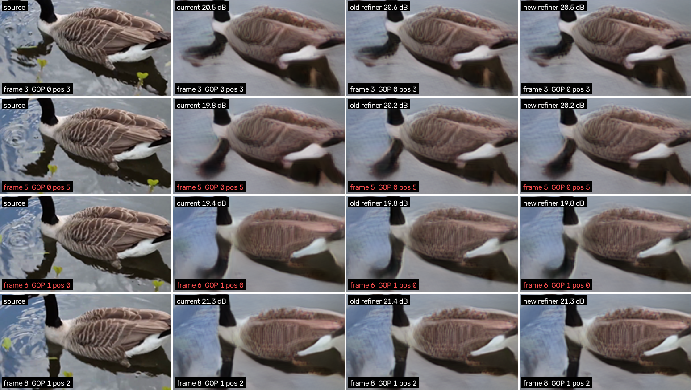
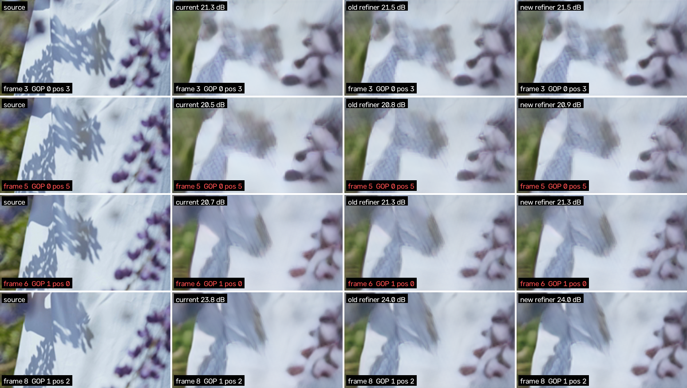
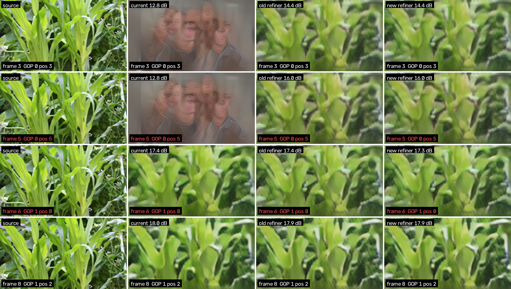
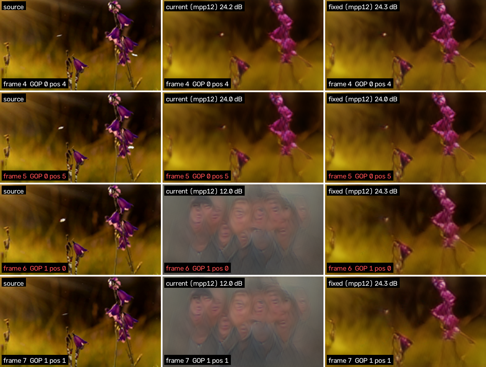

---
cursor:
  subagentId: "bc-7686c10a-0ae8-5b43-a8b3-74588e994224"
---

# GOP boundaries on V8 (issue #7)

**Status (2026-09-26): the first refiner (`v8-gop-refiner-hq.pt`) is withdrawn.** Patrick saw it freeze motion. A motion-preserving replacement, `v8-gop-refiner-motion.pt`, meets the new ship rule on the 64 eval clips. One limit remains: when a fade wipes out a whole GOP, the refiner fills it with a nearly still picture.

On the 64 eval clips, scored once, through the V8 modem + `mpp12`:

| Receiver | `mpp12` PSNR | Δ vs current | `mpp12` LPIPS | Healthy-GOP motion vs current (energy / flow) |
|---|---:|---:|---:|---:|
| Current (`v8-hf3k-mpp12-ft`, PR #29) | 20.73 ± 0.50 | — | 0.257 | 1 / 1 |
| First refiner (HQ, withdrawn) | 21.77 ± 0.45 | +1.04 ± 0.17 | 0.193 | 0.94 / 0.96 |
| **New refiner (motion)** | **21.75 ± 0.46** | **+1.02 ± 0.18** | **0.193** (−0.064 ± 0.012) | **1.05 / 1.01** |

**New ship rule and the new refiner:**

| Condition | Result |
|---|---|
| `mpp12` PSNR at least 20.73 + 0.2 = 20.93 dB | 21.75 dB, pass |
| Healthy-GOP motion within about 5% of the current receiver | Flow +1.4%, energy +5.3% (more motion, not less), pass |
| `mpp12` LPIPS not worse | −0.064 ± 0.012, pass |
| Frames and MP4 show motion kept | Kept on healthy GOPs (eval clips 18 and 19). A GOP that is wiped out is still filled with a nearly still picture (eval clip 6). |

Code and PR: branch `cursor/gop-boundary-4224` ([PR #33](https://github.com/plaingca/AETV/pull/33)), stacked on PR #29.

## A. Motion, measured

**Metrics** (`scripts/eval_gop_motion.py`). Each is computed per transition (frame t−1 to t) on `mpp12` output:

- **Energy ratio:** the mean squared frame difference of the reconstruction over the source's, pooled over transitions as a ratio of sums.
- **Flow ratio:** Farneback optical-flow magnitude on luma, reconstruction over source, pooled the same way.
- **Flow error (EPE):** the mean endpoint error of the reconstruction's flow against the source's flow.
- **Frame-difference PSNR:** as in §1 below.

**Healthy and faded GOPs.** GOP confidence has two clear groups. On the 128 eval GOPs:

- **Faded** (mean confidence below 0.35): 15 GOPs, at 0.10–0.23, which decode at 7–15 dB.
- **Healthy:** 113 GOPs, all at 0.5 or above.

A boundary counts as healthy only if both of its GOPs are healthy. "High motion" is the top quartile of clips by source flow (16 clips).

**64 eval clips, ratios against the source.** Current / first refiner (HQ) / causal / new refiner:

| Transitions | n | Energy ratio | Flow ratio | Flow error | Frame-diff PSNR (dB) |
|---|---:|---|---|---|---|
| Inside healthy GOPs | 565 | 0.394 / 0.370 / 0.373 / **0.415** | 0.714 / 0.687 / 0.697 / **0.724** | 0.712 / 0.710 / 0.712 / 0.710 | 26.49 / 26.52 / 26.49 / 26.45 |
| Inside healthy GOPs, high motion | 145 | 0.410 / 0.387 / 0.390 / **0.429** | 0.712 / 0.687 / 0.695 / **0.713** | 1.507 / 1.516 / 1.514 / 1.509 | 20.53 / 20.55 / 20.55 / 20.54 |
| Inside faded GOPs | 75 | 0.002 / 0.007 / 0.009 / 0.009 | 0.068 / 0.065 / 0.066 / 0.070 | 0.938 / 0.949 / 0.941 / 0.952 | 26.64 / 26.51 / 26.44 / 26.44 |
| Healthy boundary | 49 | 1.223 / 0.304 / 0.647 / 0.343 | 1.907 / 0.604 / 1.104 / 0.623 | 1.809 / 0.950 / 1.183 / 0.995 | 21.01 / 25.38 / 23.19 / 25.17 |
| Boundary next to a faded GOP | 15 | 8.363 / 0.040 / 4.653 / 0.048 | 3.683 / 0.151 / 1.631 / 0.134 | 4.118 / 0.983 / 2.204 / 0.999 | 12.27 / 26.36 / 18.80 / 26.13 |

**The same, relative to the current receiver.** These are paired geometric means over clips, with log standard errors of about 0.005–0.012:

| Transitions | First refiner (HQ) energy / flow | Causal energy / flow | New refiner energy / flow |
|---|---|---|---|
| Inside healthy GOPs | ×0.952 / ×0.952 | ×0.980 / ×0.978 | **×1.113 / ×1.028** |
| Inside healthy GOPs, high motion | ×0.943 / ×0.962 | ×0.949 / ×0.975 | **×1.061 / ×1.000** |

**Where the first refiner froze motion:**

1. **Inside healthy GOPs:** it cut motion by about 5% (energy and flow both ×0.95), on top of a decoder that already keeps only 39% of the source's frame-difference energy and 71% of its flow. The causal refiner cut it by 2–5%.
2. **Inside faded GOPs:** the hidden GOP is essentially a still picture, with 6.5% of the source's flow. The current receiver is just as still there (6.8%), but it shows a ghost collage of faces instead. Every refiner copies the neighbouring GOP's picture, and the lost motion is not recovered. This is the most visible freeze, and the first MP4 (3 fps, three of its four clips had a faded GOP) was mostly this.
3. **At healthy boundaries:** the current receiver overshoots (flow 1.9× the source) because of the jump. After the first refiner the boundary moves at 0.60× the source, a little below the 0.69× inside a GOP. That smooths the jump more than it freezes motion.

**Where the PSNR gain comes from** (per-GOP PSNR change against current, over the 128 eval GOPs):

| Receiver | Healthy GOPs (113) | Faded GOPs (15) | Share of the clip mean from faded GOPs |
|---|---:|---:|---:|
| First refiner (HQ) | +0.318 ± 0.030 | +6.45 ± 0.71 | 0.755 of 1.036 dB |
| New refiner | +0.303 ± 0.031 | +6.44 ± 0.72 | 0.754 of 1.022 dB |
| Causal | +0.111 ± 0.021 | +3.45 ± 1.03 | 0.405 of 0.503 dB |

About three quarters of the gain comes from hiding faded GOPs. The new refiner keeps 95% of the healthy-GOP gain with motion at or above the current receiver's, so that gain was not mainly frame averaging.

## B. The fix: gate by confidence, and forbid removing motion

`BoundaryRefiner` now accepts `healthy_gate`. A faded GOP (confidence below 0.35) always gets the full correction. On a healthy GOP the correction is multiplied by a gain per GOP position, which can be fixed or learned.

**Zero-training check on the first refiner** (24 pool selection clips, fixed gain on healthy GOPs):

| Healthy gain | `mpp12` Δ | LPIPS Δ | Healthy inside motion vs current (energy / flow) | Healthy-boundary frame-diff PSNR |
|---:|---:|---:|---|---:|
| 1 (first refiner) | +1.85 ± 0.55 | −0.084 | ×0.962 / ×0.944 | 27.18 |
| 0.75 | +1.83 ± 0.55 | −0.082 | ×0.954 / ×0.958 | 26.28 |
| 0.5 | +1.78 ± 0.55 | −0.079 | ×0.957 / ×0.971 | 24.76 |
| 0.25 | +1.69 ± 0.56 | −0.076 | ×0.972 / ×0.985 | 23.24 |
| 0 (healthy GOPs untouched) | +1.57 ± 0.58 | −0.072 | ×1.000 / ×1.000 | 21.85 (as current) |

Gating alone would pass. However, at a gain of 0 the healthy-boundary jump comes back.

**Trained fix** (`models/v8-gop-refiner-motion.pt`):

- **Warm start:** from the first refiner, with a learned healthy gate per position (starting at 0.5).
- **Added loss:** a hinge that penalizes the refiner for giving an inside-healthy-GOP transition less frame-difference energy than the decoder did, at full and 1/4 resolution (weight 2). This is on top of the per-GOP log-MSE, the frame-difference log-MSE and VGG-LPIPS (weight 3).
- **Schedule:** lr 1e-4, 3,000 steps.
- **Data:** training-pool clips through the real V8 modem + `mpp12`, with 8-bit cached decodes.
- **Selection:** 24 pool clips. The best `mpp12` among checkpoints with no LPIPS rise and healthy motion (energy and flow) at least 0.97× current.
- **Kill check at step 1000** (pool): `mpp12` +1.82 ± 0.55 (at least +0.2 required), LPIPS −0.082, motion energy ×1.067 and flow ×1.024. Pass.
- **Selected step 2000** (pool): `mpp12` +1.85 ± 0.55, LPIPS −0.083 ± 0.023, motion energy ×1.065 and flow ×1.018.
- **Learned healthy gate:** 0.58, 0.50, 0.46, 0.48, 0.52, 0.59 (by GOP position). It acts most on the frames next to a boundary.

**Rejected variant B:** the same, plus a floor asking faded GOPs for at least 0.35× the source's motion. On pool clips it made flicker, not motion:

- Faded-GOP energy rose to 2.2× the source, while frame-difference PSNR fell from 31.5 to 24.3 dB and flow error rose.
- `mpp12` was lower: +1.70 against A's +1.85.

It was dropped on pool results. With a two-GOP window, a lost GOP has only one neighbour, so its motion cannot be interpolated.

**New refiner, eval details** (64 clips, paired against current):

- **Boundary:** frame-difference PSNR is 25.39 dB, +6.43 ± 0.72, against +6.65 for the first refiner.
- **Inside-GOP frame-difference PSNR:** −0.05 ± 0.02 dB.
- **Frame PSNR by GOP position:** 21.59, 21.88, 22.06, 22.02, 21.82, 21.42 dB.

## C. Frames and video (motion)

Columns: source | current | first refiner | new refiner, all on `mpp12`. Grid rows are frames 3, 5, 6 and 8, and the boundary falls between the second and third rows.

- 
- 
- 
- Video at 6 fps (V8's real rate): [`media/gop-boundary/gop-boundary-motion-mpp12-6fps.mp4`](../media/gop-boundary/gop-boundary-motion-mpp12-6fps.mp4). It plays clips 18, 19 and 6, each three times. On the healthy clips all three receivers move alike. On clip 6 both refiners replace the ghost collage in GOP 0 with a nearly still picture.

| Checkpoint | Bytes | SHA-256 |
|---|---:|---|
| `models/v8-gop-refiner-motion.pt` (step 2000) | 27,460,830 | `9afda104e9c0801bc62356ea5dcb5d745f625319506a00e2a1bc26829871a833` |

```bash
$PY scripts/cache_v8_draws.py --split train --draws 4 --out runs/gop-boundary/train4.pt   # then stored as uint8
$PY scripts/train_gop_refiner.py --train runs/gop-boundary/train4-u8.pt --select runs/gop-boundary/select24.pt \
  --out runs/gop-refiner-motion-a --init models/v8-gop-refiner-hq.pt --healthy-gate learned --gate-init 0 \
  --motion-weight 2 --lpips-weight 3 --lr 1e-4 --warmup 100 --steps 3000 --kill-mpp12 0.2
$PY scripts/eval_gop_motion.py --cache runs/gop-boundary/eval64.pt --refiner hq=models/v8-gop-refiner-hq.pt \
  --refiner causal=models/v8-gop-refiner-causal.pt --refiner motion=models/v8-gop-refiner-motion.pt \
  --out runs/gop-boundary/eval64-motion-v2.json
$PY scripts/render_gop_boundary.py --cache runs/gop-boundary/eval64.pt \
  --refiner "old refiner=models/v8-gop-refiner-hq.pt" --refiner "new refiner=models/v8-gop-refiner-motion.pt" \
  --clips 18 19 6 --frames 3 5 6 8 --suffix motion-f03-f08 --name gop-boundary-motion-mpp12-6fps.mp4 --loops 3 \
  --out media/gop-boundary
```

---

# First refiner (2026-09-26, withdrawn)

The sections below are the original report on the first refiner. It is kept for the boundary measurements and the ablations.

## 1. The problem, measured

V8 codes each 6-frame GOP independently. A 12-frame eval clip is two GOPs, so there is one boundary, between frames 5 and 6. The `mpp12` fade is drawn per GOP, so the two halves of a clip get independent errors.

**Metrics** (`aetv/gop_boundary.py`, all computed on `mpp12` output):

- **Frame-difference PSNR** at transition t is `10·log10(1 / MSE((r_t − r_{t−1}) − (s_t − s_{t−1})))`, where r is the reconstruction and s the source. It is 100 dB when the motion is exactly right. The boundary transition is 5→6. The within-GOP value averages the other ten transitions.
- **Excess jump** is `mean|r_t − r_{t−1}| − mean|s_t − s_{t−1}|`, in 8-bit levels. It is positive when the picture moves more than the source.
- **`mpp12` PSNR** is the shared scorer's statistic, the mean of per-GOP PSNR. The measurement harness reproduces the published 20.731 dB to the last digit, as well as LPIPS 0.257.

**Current model (`v8-hf3k-mpp12-ft.pt`), 64 eval clips:**

| Transition | 0→1 | 1→2 | 2→3 | 3→4 | 4→5 | **5→6 (boundary)** | 6→7 | 7→8 | 8→9 | 9→10 | 10→11 |
|---|---:|---:|---:|---:|---:|---:|---:|---:|---:|---:|---:|
| Frame-difference PSNR (dB) | 26.47 | 26.84 | 26.60 | 26.80 | 26.31 | **18.96** | 26.41 | 26.97 | 26.54 | 26.40 | 25.77 |

| Position in GOP | 0 | 1 | 2 | 3 | 4 | 5 |
|---|---:|---:|---:|---:|---:|---:|
| Frame PSNR (dB) | 20.46 | 20.87 | 21.08 | 21.03 | 20.83 | 20.34 |

- **The boundary is 7.1 ± 0.7 dB worse** in frame-difference PSNR than a within-GOP transition.
- **The excess jump** is +15.0 levels at the boundary, against −4.7 inside a GOP. Inside a GOP the picture is slightly too still, but at the boundary it lurches.
- **The first and last frames** of a GOP are 0.6–0.7 dB below the middle frames.

**What the jump looks like.** On a typical clip the face, colour and sharpness change at frame 6 (eval clip 14). When a fade wipes out most of a GOP, the decoder falls back to its prior and paints a ghost collage of faces for the whole GOP, which is the "scene morphing" in the issue. The picture then snaps back at the next boundary (eval clips 29, 50 and 12).

## 2. The fix: a receiver-side boundary refiner

`BoundaryRefiner` (`aetv/gop_boundary.py`) is a 6.9M-parameter residual 3D U-Net. It runs after the unchanged V8 decoder, on a window of decoded frames.

- **Inputs per frame:** the decoded RGB, a one-hot of the frame's position in its GOP, and its GOP's mean modem confidence. That confidence is already computed by the receiver, so nothing new goes on the wire.
- **Temporal resolution is never reduced.** Normalization is per frame, so a frame's output depends on neighbouring frames only through convolutions.
- **The last layer starts at zero,** so the untrained refiner is exactly the identity.
- **HQ mode** (`causal=False`, `models/v8-gop-refiner-hq.pt`): symmetric temporal convolutions. For streaming, run it on the previous, current and next GOP and keep the middle one. That is one GOP (1 s) of latency.
- **Causal mode** (`causal=True`, `models/v8-gop-refiner-causal.pt`): the convolutions pad only the past, so a frame depends on itself and earlier decoded frames. The first frames of a GOP are conditioned on the previous GOP's last decoded frames, with no added latency. A unit test checks strict causality.
- **Cost:** 33 ms per 18-frame window on the RTX 4090 in fp32, against the V8 decoder's 10 ms per GOP. The budget is one GOP per second.

**Training** (`scripts/train_gop_refiner.py`): only the refiner is trained. The codec is frozen.

- **Inputs:** frozen-codec decodes through the real V8 OFDM modem and `emulate(..., "mpp12")`, cached by `scripts/cache_v8_draws.py`.
- **Data:** 1,303 training-pool clips × 4 fade draws, with training fade seeds from 1,000,000. The 64 eval clips and the 24 selection clips are excluded.
- **Loss:** the mean per-GOP `log10` MSE (the `mpp12` PSNR statistic), plus 0.25 × the mean `log10` frame-difference MSE, plus 3 × VGG-LPIPS on 4 random frames per clip. The score uses AlexNet LPIPS, so the guardrail metric is not trained on directly.
- **Schedule:** AdamW, lr 2e-4 with a 200-step warmup and cosine decay. Batch 8, 8,000 steps, about 65 minutes.
- **Selection:** the best `mpp12` PSNR on the 24 pool selection clips (fade seed base 7300), among checkpoints whose pool LPIPS did not rise.
- **Kill check at step 1000** (pool): `mpp12` must not fall, the boundary frame-difference PSNR must rise by more than 2× SE, and LPIPS must not rise.

| Run | Kill check at step 1000 (pool, paired) | Selected step (pool, paired) |
|---|---|---|
| HQ | `mpp12` +1.34 ± 0.38, boundary +6.27 ± 0.95, LPIPS −0.055 ± 0.017: pass | 8000: `mpp12` +1.85 ± 0.54, boundary +9.27 ± 1.54, LPIPS −0.084 ± 0.024 |
| Causal | `mpp12` +0.35 ± 0.23, boundary +1.52 ± 0.45, LPIPS −0.020 ± 0.010: pass | 4500: `mpp12` +0.49 ± 0.26, boundary +2.87 ± 0.68, LPIPS −0.029 ± 0.012 |

## 3. Results on the 64 eval clips (scored once)

Each row is paired against the current model on the same decodes, with ± the paired SE. Fade seeds are `2026 + clip·2 + gop`.

| Receiver | `mpp12` PSNR | Δ `mpp12` | `mpp12` LPIPS | Boundary frame-diff PSNR | Δ boundary | Boundary gap vs within-GOP | Excess jump at boundary |
|---|---:|---:|---:|---:|---:|---:|---:|
| Current (no refiner) | 20.73 ± 0.50 | — | 0.257 | 18.96 | — | 7.11 dB | +15.0 |
| **HQ refiner** | **21.77 ± 0.45** | **+1.04 ± 0.17** | **0.193** (−0.064 ± 0.012) | **25.61** | **+6.65 ± 0.74** | **0.47 dB** | −4.4 |
| Causal refiner | 21.23 ± 0.48 | +0.50 ± 0.15 | 0.219 (−0.038 ± 0.009) | 22.16 | +3.20 ± 0.50 | 3.88 dB | +5.6 |
| HQ, MSE only (no LPIPS term) | 21.95 ± 0.45 | +1.22 ± 0.17 | 0.318 (+0.062 ± 0.011) | 25.72 | +6.76 ± 0.72 | 0.46 dB | −4.7 |
| Ablation: same network, one GOP at a time | 20.85 ± 0.50 | +0.12 ± 0.02 | 0.368 (+0.111 ± 0.006) | 19.28 | +0.32 ± 0.04 | 6.86 dB | +14.3 |

**Frame PSNR by position in the GOP (dB):**

| Receiver | 0 | 1 | 2 | 3 | 4 | 5 |
|---|---:|---:|---:|---:|---:|---:|
| Current | 20.46 | 20.87 | 21.08 | 21.03 | 20.83 | 20.34 |
| HQ refiner | 21.62 | 21.89 | 22.06 | 22.02 | 21.83 | 21.43 |
| Causal refiner | 21.13 | 21.41 | 21.57 | 21.51 | 21.28 | 20.74 |

**Reading the table:**

- **Ship gates:** the HQ refiner clears 20.73, 0.2 dB and 2× SE on `mpp12` PSNR, and improves both the boundary metric (9× SE) and LPIPS. The causal refiner also clears every gate, by a smaller margin. Its PSNR gain is 3.4× SE, with 51 of 64 clips up.
- **The gain comes from crossing the boundary.** The same network confined to one GOP gains only +0.12 dB and leaves the boundary as it was. Given the neighbouring GOP, the refiner can hide a faded GOP with content from the other one, and blend the two decodes where they meet.
- **The LPIPS term is what keeps it sharp.** Without it, the refiner gains 0.18 dB more PSNR, but LPIPS gets worse by 0.062, failing the guardrail. With it, LPIPS improves by 0.064.
- **Causal is weaker for a structural reason.** It cannot revise the last frames of a GOP once the next one arrives, and it cannot hide a lost first GOP. That is why its last-position frames gain only 0.4 dB.
- **What remains:** the GOP-edge frames are still about 0.5 dB below mid-GOP frames. After the HQ refiner the boundary is as still as the interior (excess jump −4.4 vs −4.6 levels): both are slightly smoother than the source.

## 4. Frames and video

Columns: source | current (`v8-hf3k-mpp12-ft` on `mpp12`) | fixed (HQ refiner). Rows are frames 4–7, and the boundary falls between the second and third rows. Tags in red mark the first and last frame of a GOP. Clips 29, 50 and 12 are the eval clips with the worst boundary. Clip 14 is a median clip.

- 
- 
- 
- 
- Video: [`media/gop-boundary/gop-boundary-mpp12-side-by-side.mp4`](../media/gop-boundary/gop-boundary-mpp12-side-by-side.mp4) shows all 12 frames of the four clips at 3 fps (half speed), with per-frame PSNR.

## 5. Limits

- **Two-GOP windows only.** The shared clips are 12 frames, so every score here uses a window of two GOPs. HQ streaming would use three GOPs (previous, current, next). The network is fully convolutional with per-frame normalization, so that is well defined, but it is not measured. No longer clips are cached at 6 fps.
- **Latency.** HQ mode adds one GOP (1 s at 6 fps) of display latency. Causal mode adds none.
- **One codec.** Both refiners are trained on `v8-hf3k-mpp12-ft.pt` decodes. A new codec checkpoint needs a new refiner, which takes about an hour on the 4090 plus a 2.5-minute cache build.
- **Receiver compute.** The receiver must run the refiner. It costs about 3× the decoder, and needs a GPU for real time.

## Reproduce

```bash
PY=/home/plaing/AETV/.venv/bin/python
$PY scripts/cache_v8_draws.py --split eval --out runs/gop-boundary/eval64.pt
$PY scripts/cache_v8_draws.py --split select --out runs/gop-boundary/select24.pt
$PY scripts/cache_v8_draws.py --split train --draws 4 --out runs/gop-boundary/train4.pt
$PY scripts/train_gop_refiner.py --train runs/gop-boundary/train4.pt --select runs/gop-boundary/select24.pt \
  --out runs/gop-refiner-lp3 --lpips-weight 3
$PY scripts/train_gop_refiner.py --train runs/gop-boundary/train4.pt --select runs/gop-boundary/select24.pt \
  --out runs/gop-refiner-causal-lp3 --causal --lpips-weight 3
$PY scripts/eval_gop_boundary.py --cache runs/gop-boundary/eval64.pt \
  --refiner hq=models/v8-gop-refiner-hq.pt --refiner causal=models/v8-gop-refiner-causal.pt \
  --out runs/gop-boundary/eval64-final.json
$PY scripts/render_gop_boundary.py --cache runs/gop-boundary/eval64.pt \
  --refiner models/v8-gop-refiner-hq.pt --clips 29 50 12 14 --out media/gop-boundary
```

| Checkpoint | Bytes | SHA-256 |
|---|---:|---|
| `models/v8-gop-refiner-hq.pt` (step 8000) | 27,459,883 | `ce46b570d1ddd3dbcf026c4b9b0cdf3eacd5017b46b492b70c94cea6ce7e65fc` |
| `models/v8-gop-refiner-causal.pt` (step 4500) | 27,460,243 | `b4d7221fcf1b48572940c47e913593d6ecbd85bed68d7c2bb94e3e4f480d3a87` |
