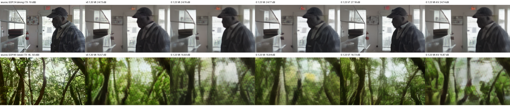
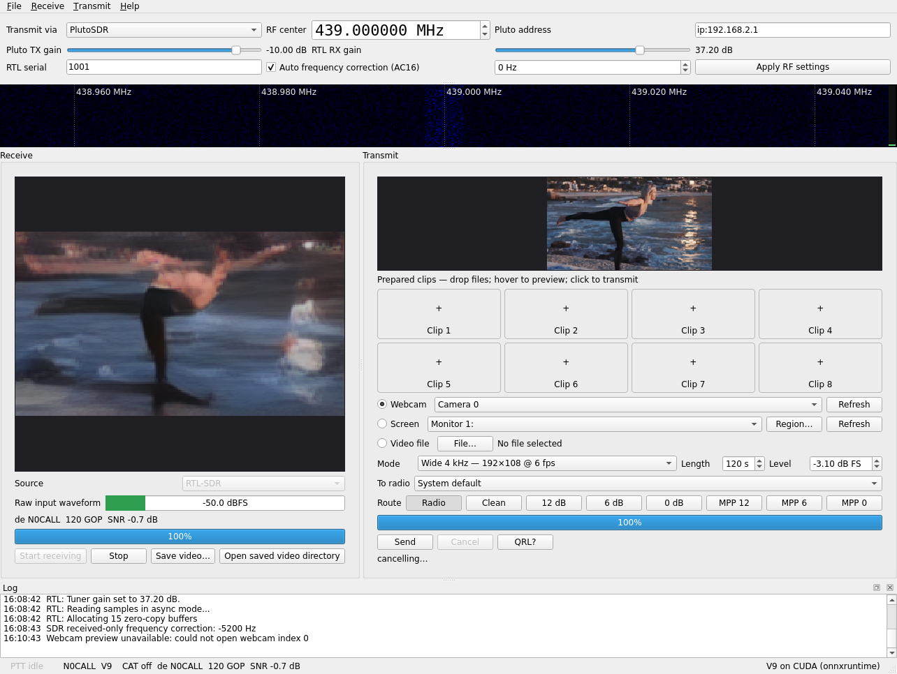
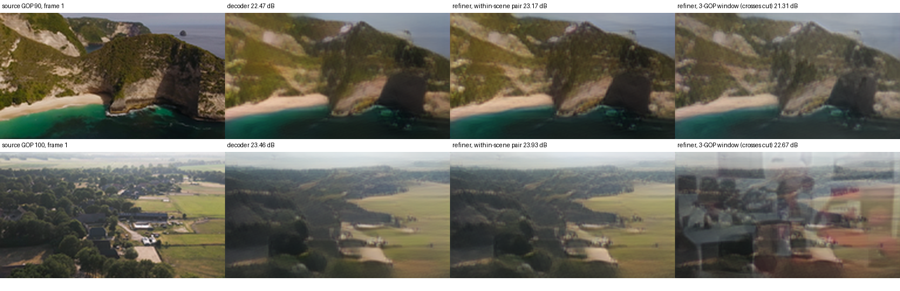

---
cursor:
  subagentId: "bc-537e5af2-01e8-5dcf-8260-fc6168862af6"
---

# AETV 0.1.23 release report (2026-09-26)

**Outcome: shipped as [AETV v0.1.23](https://github.com/plaingca/AETV/releases/tag/v0.1.23).**

- **PRs:** all six approved PRs are merged.
- **Models:** the new models are on the Hub and checksum-pinned.
- **OTA:** the Linux release candidate passed over the air in V8, V9, V7 and V8 A/V, plus QRL?, with no regression against v0.1.20.
- **V8 default:** the V8 channel fine-tune is the new V8 default.
- **Refiner:** the GOP-boundary refiner is published, but it is **not** a live default (see [Refiner](#refiner)).

Main is at `1caf0db` and tag `v0.1.23` points to it.

## Merge log

Each PR was rebased onto main, retargeted, marked ready, tested with the full suite, then merged with a merge commit. The baseline on main before any merge was 469 passed, 2 skipped.

| Order | PR | Merge commit | Suite after rebase | Notes |
|---:|---|---|---|---|
| 1 | [#28 shared scorer](https://github.com/plaingca/AETV/pull/28) | `ee08257` | 476 passed | See below. |
| 2 | [#29 V8 channel fine-tune](https://github.com/plaingca/AETV/pull/29) | `d1d947a` | 476 passed | Clean. |
| 3 | [#33 GOP boundary refiner (motion)](https://github.com/plaingca/AETV/pull/33) | `e814ba9` | 481 passed | Clean. |
| 4 | [#32 V9 4 kHz wide mode](https://github.com/plaingca/AETV/pull/32) | `7db49e4` | 487 passed | Clean. |
| 5 | [#30 QRL? button](https://github.com/plaingca/AETV/pull/30) | `c727407` | 504 passed | Clean. Also checked against V9: 2 slots. |
| 6 | [#31 HackRF realtime fix](https://github.com/plaingca/AETV/pull/31) | `cb3489b` | 507 passed | Clean. |
| 7 | [#34 release 0.1.23](https://github.com/plaingca/AETV/pull/34) | `1caf0db` | 507 passed | Model pins, version bump, replay-tool fix. |

**#28:** its base branch carried four commits from closed PR #27: AC2K, the codebook and DeepStream codecs, and 70 MB of weights. Only #28's own commit was rebased. The scorer imported two helpers (`impair_wire`, `global_ssim`) from that stack at module level, so they were inlined. The lazy AC2K/AC6 adapters were left as they were; those modules were never on main.

CI (Linux and Windows) passed on main after the last PR merge and on the release branch.

**One regression was found and fixed in #34.** #31's calibration stride calls `.empty()` on the SDR input queue. The replay tool's stand-in queue had no such method, so `scripts/replay_sdr_stress.py` crashed. The live app was unaffected.

## Models and Hub

Hugging Face commit [`526c439`](https://huggingface.co/AETV/AETV/commit/526c439230c367d024f11e039785e303843a024a) on `AETV/AETV` added these files, and updated `manifest.json` and `README.md`:

- `v8-hf3k-mpp12-ft` (checkpoint plus ONNX bundle)
- `v9-wide4k` (checkpoint plus ONNX bundle)
- `v8-gop-refiner-motion.pt` and its JSON metadata

Pins in `aetv/codec.py`:

- `HF_MODE_REVISIONS["V8"]` and `["V9"]` are set to that commit.
- The byte counts and SHA-256 of both checkpoints and runtime bundles are pinned.

Validation before and after the upload:

- **Checksums:** `validate_model_release.py` passes. It gained `--only` and a check for the new `receiver_files` entry.
- **ONNX parity:** ONNX matches PyTorch within 5e-5 for both new bundles.
- **Downloads:** all four release-mode bundles and both new checkpoints download and verify from a clean cache at the pinned revision.

**Decision: `v8-hf3k-mpp12-ft` becomes the V8 default; the refiner does not.**

- **The fine-tune passes the ship rule.** On `mpp12` it gains +0.25 ± 0.05 dB over the V8 bar (20.48 dB), which is at least 0.2 dB and more than twice the standard error. LPIPS moves by +0.002 ± 0.003, which is within noise.
- **Mixed versions cost some quality.** Measured on 64 eval clips with the V8 modem and `mpp12`, old TX to new RX loses 0.45 ± 0.14 dB, and new TX to old RX loses 0.86 ± 0.15 dB. The release notes ask both stations to upgrade.
- **The refiner has no live receiver path.** #33 added the module and eval scripts only. The OTA replay also shows it hurts across scene cuts (below).

## Release candidate build

Both Linux packages were built with `scripts/build_linux.sh`, GPU and CPU, from the release branch at `e35bb24`. That tree is identical to the tag apart from the unpackaged replay script. Build tools were supplied locally without system installs:

- `rigctl` was extracted from the `libhamlib-utils` .deb into `/tmp`.
- `appimagetool` was checksum-verified, as in CI.

**Build smoke tests passed for both packages.** The script's built-in tests cover:

- native SDR and GUI SDR
- Save Video
- the V8 benchmark, which ran on the new bundle
- the AC16 benchmark and AC16 A/V
- the GUI smoke test

**Packaged benchmarks:**

| Mode | RTX 4090 encode / decode | CPU (8 threads) encode / decode | CPU full duplex |
|---|---:|---:|---:|
| V8 | 7.2 / 10.6 ms | 101 / 215 ms | 3.17× real time |
| V9 | 7.0 / 10.3 ms | 101 / 214 ms | 3.18× |
| V7 | 16.4 / 38.0 ms | 440 / 944 ms | 0.72× (below real time, as in 0.1.20) |
| AC16 | 18.2 / 21.4 ms | 169 / 259 ms | 2.33× |

## Over-the-air results

**Setup.** This matches the 0.1.20 trials in `docs/all-modes-sdr-stress.md`:

- **Radios:** PlutoSDR (`ip:192.168.2.1`) transmitting at 439 MHz to RTL-SDR serial 1001 at 37.2 dB gain, about 3 m apart. Serial 1002 was not used because of its known fault.
- **Hardware check:** before the trials, `lsusb` showed one PlutoSDR and five RTL2838 dongles.
- **Application:** the packaged GPU GUI in `--ota-validation` stress mode. The audio went to a PulseAudio null sink, which was removed afterwards.
- **Fixture:** `source.npy`, 30 training-disjoint clips (SHA-256 `85f201e2…`).
- **Schedule:** 120 GOPs per trial. TX gain was −10 dB until 60 s, then the mode's weak gain from the 0.1.20 trials: V8 and V9 −50, V7 −45, V8 A/V −47 dB.
- **Baseline:** v0.1.20 (downloaded GPU package, checksum-verified) was run in the same session, interleaved with the release candidate.
- **Pluto shutdown:** power-down and minimum gain were verified from a fresh context after every trial.

**Scoring.** PSNR is pooled over the 10–58 s (strong) and 70–118 s (weak) windows against the frames the transmitter actually consumed. It uses the 2026-09-14 scorer, with source identity from beacons or latent match. The "all GOPs" column instead aligns every decoded GOP by arrival time and excludes none.

| Trial | Decoded | Strong PSNR | Weak PSNR | Weak, all GOPs | Weak beacon-verified / ambiguous | Median SNR strong / weak | Median presentation latency |
|---|---:|---:|---:|---:|---:|---:|---:|
| **V8, 0.1.23** | 120/120 | **21.19** | **18.69** | 18.68 | 21 / 1 | 29.9 / −0.5 dB | 2.82 s |
| V8, 0.1.20 | 120/120 | 21.10 | 18.60 | 18.60 | 38 / 0 | 30.6 / −0.7 dB | 2.83 s |
| **V9, 0.1.23**, weak −50 dB | 120/120 | **21.39** | 18.66 (23 valid) | 18.49 | 0 / 25 | 35.4 / −1.0 dB | 2.83 s |
| **V9, 0.1.23**, weak −47.75 dB | 120/120 | 21.38 | **19.52** | 19.52 | 31 / 0 | 35.2 / 1.4 dB | — |
| **V7, 0.1.23** | 120/120 | 22.54 | 20.48 | 20.48 | 48 / 0 | 36.7 / 4.5 dB | 2.97 s |
| V7, 0.1.20 | 120/120 | 22.54 | 20.53 | 20.53 | 48 / 0 | 37.0 / 4.6 dB | 2.99 s |
| **V8 A/V, 0.1.23** | 120/120 | **21.21** | **18.74** | 18.74 | 38 / 0 | 32.2 / −0.5 dB | 3.79 s |
| V8 A/V, 0.1.20 | 120/120 | 21.12 | 18.53 | 18.53 | 36 / 0 | 32.7 / −0.5 dB | 3.89 s |

Every trial completed, with zero receiver errors, zero PortAudio underflows and 720 or more displayed frames. V8 A/V audio-tone pairing error p95 was 0.18 Hz for 0.1.23 and 0.24 Hz for 0.1.20.

**No regressions against 0.1.20.**

- V8 and V8 A/V gain about 0.1–0.2 dB. That is smaller than the +0.25 dB `mpp12` gain, as expected on a static link without Watterson fading.
- V7 is unchanged within noise (−0.05 dB weak). V7's model and code are unchanged.
- In the weak window, RC V8 verified fewer beacons than v0.1.20 (21 of 48 against 38 of 48). Median weak SNR was −0.5 and −0.7 dB, which is right at the beacon CRC threshold, and every GOP was still delivered and scored. This is worth watching in a longer weak-signal trial, but it is not a decode failure.

**V9 at the same TX gain as V8** spreads that power over 1.7× the bandwidth, so each carrier gets about 2.3 dB less SNR.

- **Same TX gain:** 25 of 48 weak GOPs had latent cosine below 0.5 and no beacon verified. All 48 still decoded to the correct source GOP, and V9 scored 18.49 dB over all GOPs against V8's 18.68 dB.
- **Equal per-carrier SNR** (−47.75 dB): V9 reaches **19.52 dB, +0.84 dB over V8's weak window**. This matches the +0.79 dB `mpp12` result.

More GUI captures: [V8](../media/release/gui-rc-V8.png), [V7](../media/release/gui-rc-V7.png), [V8 A/V](../media/release/gui-rc-V8_AV.png), [v0.1.20 V8](../media/release/gui-prev-V8.png).

### QRL?

The production `TxEngine.transmit_qrl()` from the tagged source keyed the Pluto at −10 dB, and RTL 1001 captured the I/Q. The Morse was decoded offline from each slot's keying envelope. The callsign was the default placeholder, `N0CALL`.

| Mode | Slots | Decoded text, every slot | Keying contrast | Measured − expected frequency |
|---|---:|---|---:|---:|
| V8 | 1 | QRL? DE N0CALL | 55.8 dB | −5.10 kHz |
| V9 | 2 | QRL? DE N0CALL | 53.0–53.3 dB | −5.10 kHz |
| AC16 A/V | 8 | QRL? DE N0CALL | 47.4–47.7 dB | −5.10 kHz |

Slot spacing is exactly 2.5 kHz. The common −5.1 kHz offset is the combined error of the Pluto and RTL crystals, about 12 ppm. The live receiver corrects it automatically (−5.2 kHz in the V9 GUI capture).

### Refiner

The live receiver has no refiner path, so it was tested on identical received data. The RC V8 capture was replayed through the production receiver; the replayed latents match the live ones with cosine 1.000. The GOPs were then decoded with the V8 fine-tune, and three receivers were compared:

| Arm | Strong PSNR | Weak PSNR | Per-GOP Δ, weak | Motion energy vs decoder, weak |
|---|---:|---:|---:|---:|
| Decoder only | 21.17 | 18.65 | — | 1 |
| Refiner, 2-GOP pairs within one scene (its eval protocol) | 21.15 | **19.07** | **+0.54 ± 0.06 dB** | 1.06 |
| Refiner, 2-GOP pairs across a scene cut | 20.86 | 17.90 | −1.09 ± 0.13 dB | 1.12 |
| Refiner, 3-GOP streaming window (1 s latency) | 20.88 | 18.32 | −0.61 ± 0.11 dB | 1.17 |

**The refiner works as claimed within a scene.** It gains +0.54 dB on weak GOPs, is neutral on strong ones, and does not remove motion.

**It is harmful across scene cuts.**

- **Scene cuts:** the fixture changes clip every 2 s, so shifted pairs and every 3-GOP window straddle a cut. There the refiner ghosts the previous scene into the new one.
- **3-GOP window:** this streaming layout was never measured in #33.
- **Fading:** the static link produced no faded GOPs (confidence below 0.35), so its fade-hiding gain, three quarters of the simulated +1.02 dB, could not be observed over the air.

**Before it can be a live default, it needs:** scene-cut detection (or training across cuts), a validated streaming window, and receiver integration.

## Known limits (also in the release notes)

- **HackRF:** untested on hardware. #31 is covered by simulated-device tests.
- **Refiner:**
  - It adds 1 s of latency and is not enabled.
  - It hurts across scene cuts.
- **Faded GOPs:** they are still shown as near-still frames.
- **V9:** it needs about 2.3 dB more TX power than V8 for equal per-carrier SNR. At V8's weak level, its beacon verification drops out.
- **V7:** it is below real time for full duplex on CPU.
- **Windows:** packages are validated by CI only.

## Publication

- **Build:** pushing tag `v0.1.23` ran the release workflow ([run 36280222892](https://github.com/plaingca/AETV/actions/runs/36280222892)). Linux CPU/GPU and Windows CPU/GPU built and smoke-tested, and the release was published as Latest.
- **Release notes:** they carry the changes, scores, OTA results and known limits.
- **Published package check:** the published `AETV-linux-x64-gpu.tar.gz` matches `SHA256SUMS.txt`. It passes the SDR smoke test and runs V8 (`v8-hf3k-mpp12-ft`) and V9 on CUDA.
- **Evidence zip:** it was uploaded after the workflow, so it is not listed in `SHA256SUMS.txt`.

## Evidence

- **Release asset:** `AETV-0.1.23-OTA-evidence.zip`, attached to the release. It contains the trial configs, `metrics.json` for every trial, GUI captures, the QRL? and refiner results, the all-GOP scores, the interop scores, the benchmarks and the scripts.
- **Raw data on Beastmode:** `/pool0/AETV-runs/release-0.1.23-ota-20260926/`, with raw `rtl.cu8`, decoded RGB, latents, replays and logs.
